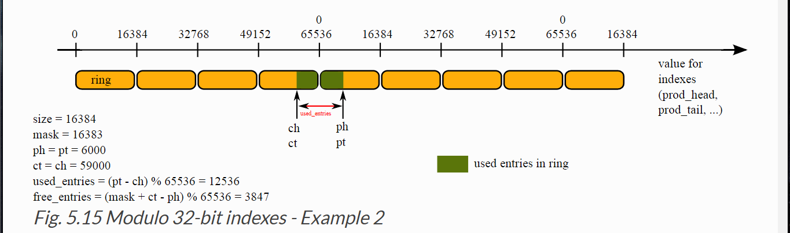
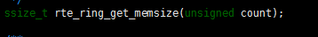
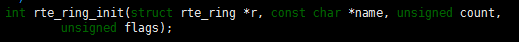
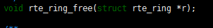
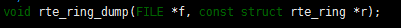
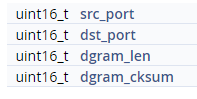

1.  **Thư viện ring**

<!-- -->

1.  Tổng quan

    Quản lý ring là hàng đơi có kích thước cố định, được triển khai một
    bảng chứa các con trỏ. Con trỏ head và tail được thay đổi vị trí,
    cho phéo đồng thời truy cập vào nó. Ring có một số tính năng:

-   FIFO

-   Kích thước lớn nhất là cố định; các con trỏ được lưu trong 1 bảng

-   Không khóa

-   Multi/single consumer/producer enqueuer/dequeuer

-   Lượng lớn enqueue/dequeuer

1.  Trường hợp sử dụng

-   Truyền thông giữa các ứng dụng trong dpdk

-   Sử dụng bởi memory pool

1.  Cấu trúc ring:

    Cấu trúc vòng ring bao gồm 2 cặp chỉ số head và tail, một cặp sử
    dụng cho producer và một cặp được dùng cho consumer.

-   Producer: một tiến trình ghi dữ liệu vào bộ đệm tại một thời điểm
    nhất định.

-   Consumer: một tiến trình đoc dữ liệu từ bộ đệm tại một thời điểm
    nhất định.

-   Head: vị trí tiến trình ghi được hoàn thành trong bộ đệm vòng.

-   Tail: vị trí tiến trình đọc được hoàn thành tại một thời điểm.

> Các chỉ số head and tail nằm trong khoảng từ 0 đến 2^32-1, và chúng ta
> dấu giá trị của chúng khi chúng ta truy cập vào bảng con trỏ. Chung ta
> có thể sử dụng phép toán cộng/trừ giữa 2 giá trị trong modulo-32 bit.
> Do vậy không xảy ra tràn các chỉ mục.
>
> 
>
> Ring có thể chứa 12536 entries

1.  Thư viện rte\_ring.h

> \*EDQOUT : là số lượng gói tin enqueue/dequeue lớn nhất tại một thời
> điểm và để thông báo việc sử dụng ring có water mark cao hay thấp.
>
> \*Water mark (threshold) mỗi lần enqueue đạt high watermark, tiến
> trình ghi sẽ được thông báo nếu water mark được cấu hình.

4.1 Tính kích thước bộ nhớ cần cho ring:

> 
>
> Hàm trả về số bytes cần cho ring, cung cấp số lượng phần tử trong
> ring. Những giá trị này là tổng của kích thước ring và kích thước bô
> nhớ cần bởi các con trỏ đối tượng. giá trị được căn chỉnh cho khớp
> kích thước cache.
>
> @count : số lượng phần tử trong ring ( chẵn)
>
> @return:
>
> - kích thước memory cần cho ring
>
> - EINVAL nếu count không chia hết cho 2
>
> 4.2 Khởi tạo cấu trúc ring
>
> 
>
> Khởi tạo cấu trúc ring trong bộ nhớ được trỏ bởi “r”. Kích thước của
> vùng nhớ phải đủ lớn để chứa cấu trúc ring và bảng object. Sử dụng
> rte\_ring\_get\_memsize() để lấy kích thước thích hợp.
>
> Kích thước ring được thiết lập bởi biến “count” và count phải chia hết
> cho 2. Watermark bị vô hiệu hóa theo mặc định
>
> Kích thước ring sử dụng thực tế là “count – 1” thay cho “count” để
> phân biệt ring rỗi và ring rỗng.
>
> Ring không được bao gồm danh sách toàn cục RTE\_TAILQ\_RING. Bộ nhớ
> được cấp bởi người gọi không được chia sẻ giữa các tiến trình dpdk.
>
> @r : con trỏ của cáu trúc ring được theo dõi bởi các bảng object
>
> @name: name ring
>
> @count: số lượng phần tử trong ring
>
> @flags:

-   RING\_F\_SP\_ENQ: nếu flag được thiết lập. Hoạt động mặc định khi sử
    dụng “rte\_ring\_enqueue()” hoặc “rte\_ring\_enqueue\_bulk()”
    là single-producer. Ngược lại là multi-producers.

-   RING\_F\_SC\_DEQ: nếu flag được thiết lập. Hoạt động mặc định khi sử
    dụng “rte\_ring\_dequeue()” hoặc “rte\_ring\_dequeue\_bulk()”
    là single-consumer. Ngược lại là multi-consumers.

> @return: 0 success / giá trị âm error.

1.  Tạo một ring mới tên “name” trong bộ nhớ

> 
>
> Hàm sử dụng “memzone\_reserve()” để phân bổ bộ nhớ. Sau đó hàm gọi đến
> rte\_ring\_init() để khởi tạo empty ring.
>
> Kích thước ring được thiết lập bởi biến “count” và count phải chia hết
> cho 2. Watermark bị vô hiệu hóa theo mặc định
>
> Kích thước ring sử dụng thực tế là “count – 1” thay cho “count” để
> phân biệt ring rỗi và ring rỗng.
>
> Ring được bao gồm danh sách RTE\_TAILQ\_RING

4.4 Giải phóng bộ nhớ

> 
>
> Giải phóng bộ nhớ được sử dụng bởi ring
>
> @r : ring để giải phóng

4.4 Thay đổi water mark cao

> 
>
> Nếu count = 0, thì water marking vô hiệu hóa. Ngược lại, nó sẽ thiêt
> lập giá trị count. Giá trị count phải lớn hơn 0 và nhỏ hơn kích thước
> ring.
>
> Hàm này được goi tất bất kì thời điểm nào ( không cần thiết tại thời
> điểm khởi tạo)
>
> @r: con trỏ câu trúc ring
>
> @count: giá trị water mark mới
>
> @return:

-   0: success, water mark được thay đổi

-   -EINVAL: giá trị water mark không hợp lệ.

4.5 Lưu trạng thái ring vào file

@f: con trỏ file được ghi ra

4.6 Thêm vào hàng đợi lượng lớn packet

> Thêm vào hàng đợi ring môt vài objects.(Không phải multi-producer)
>
> @r: con trỏ ring
>
> @obj\_table: bảng chứa địa chỉ con trỏ của objects.
>
> @n : số lượng object được thêm vào ring từ bảng obj
>
> @freespace: nếu không null, thì trả về tổng không gian trong ring sau
> khi thuật toán đệm vào hàng đợi hoàn thành
>
> @return

-   Số lương obj được enqueue thực tế

4.7

Dequeue nhiều đối tượng từ ring cho đến số lượng tối đa.

Hàm này gọi multi/single consumer, tùy thuộc vào hành vi mặc định đã
được chỉ định trong thời gian tạo ring(flags)

@Obj\_table: con trỏ trỏ đến bảng chứa con trỏ của đối tượng sẽ được lấp
đầy

@Available: nếu không NULL, trả về số entries ring còn tồn tại sau khi
dequeue hoàn thành.

@return:

-   số đối tượng được dequeuer

| struct [**rte\_ring**](http://dpdk.org/doc/api/structrte__ring.html) \*    | [**rte\_ring\_lookup**](http://dpdk.org/doc/api/rte__ring_8h.html#ad26dd65732f16f720eca5e1aa94e2a8a) (const char \*name)   |
|----------------------------------------------------------------------------|----------------------------------------------------------------------------------------------------------------------------|

Tim một ring từ tên của nó

| static unsigned int    | [**rte\_ring\_get\_size**](http://dpdk.org/doc/api/rte__ring_8h.html#aa8adfaeefc2ce7bedc31aa7e41d17f9c) (const struct [**rte\_ring**](http://dpdk.org/doc/api/structrte__ring.html) \*r)   |
|------------------------|--------------------------------------------------------------------------------------------------------------------------------------------------------------------------------------------|

Trả về kích thước của ring

| | **static unsigned int rte\_ring\_get\_capacity**   | **(** | **const struct **[**rte\_ring**](http://dpdk.org/doc/api/structrte__ring.html)** \* ** | **r** | **)** |     | 
 |----------------------------------------------------|-------|----------------------------------------------------------------------------------------|-------|-------|-----|  |
|-------------------------------------------------------------------------------------------------------------------------------------------------------------------------------|

Trả về số phần tử được lưu trong ring

1.  **Thư viện Ethernet**

    Api thiết bị Ethernet bao gồm 2 phần:

-   API Ethernet hướng ứng dụng bao gồm các chức năng cài đặt thiết bị
    Ethernet ( cấu hình, thiết lập hàng đợi RX & TX và khởi động), để
    lấy địa chỉ mac, tốc độ, trạng thái của liên kết vật lý, để nhận,
    truyền gói tin…

-   Api hướng driver xuất ra chức năng cho phép PMD đăng kí chính nó
    đồng thời như là một thiết bị Ethernet driver và như là PCI driver
    cho một bộ các thiết bị kết hợp PCI(Ethernet)

> Theo mặc định, tất cả các chức năng của Ethernet device API được xuất
> bởi PMD là các hàm không khóa mà giả định không được gọi song song
> trên các lõi logical khác nhau làm việc trên cùng một đối tượng. Ví
> dụ, chức năng nhận của PMD không thể được gọi song song trên hai lõi
> logic để thăm dò cùng một hàng đợi RX \[cùng một cổng\]. Tất nhiên,
> chức năng này có thể được gọi song song bởi các lõi logical khác nhau
> trên hàng đợi RX khác nhau. Đây là trách nhiệm của ứng dụng tầng trên
> để thực thi quy tắc này.
>
> Nếu cần thiết, các truy cập song song bởi nhiều lõi logical đến các
> hàng đợi được chia sẻ sẽ được bảo vệ rõ ràng bằng các hàm nhận dạng
> khóa nội tuyến được xây dựng trên các chức năng không khóa của PMD API
> tương ứng.
>
> Trong tất cả các chức năng của Ethernet API, thiết bị Ethernet được mô
> tả bởi một số nguyên&gt; = 0 có tên là định danh cổng thiết bị.
>
> Tai tầng Ethernet driver, các thiết bị Ethernet được biểu diễn bởi một
> cấu trúc dữ liệu chung loại rte\_eth\_dev.
>
> Các thiết bị Ethernet được đăng ký động trong giai đoạn thăm dò PCI
> được thực hiện trong thời gian khởi tạo EAL. Khi một thiết bị Ethernet
> đang được thăm dò, một cấu trúc rte\_eth\_dev và một số nhận dạng cổng
> mới được cấp phát cho thiết bị đó. Sau đó, hàm eth\_dev\_init () được
> cung cấp bởi trình điều khiển Ethernet phù hợp với thiết bị PCI thăm
> dò được gọi để khởi tạo đúng thiết bị.
>
> Vai trò của chức năng init thiết bị bao gồm đặt lại phần cứng, kiểm
> tra truy cập vào bộ nhớ non-volatile (NVM), đọc địa chỉ MAC từ NVM vv
>
> Nếu thao tác init thiết bị thành công, sự tương ứng giữa bộ nhận dạng
> cổng được gán cho thiết bị mới và cấu trúc rte\_eth\_dev liên kết được
> đăng kí có hiệu quả. Nếu không, cả cấu trúc rte\_eth\_dev và định danh
> cổng đều được giải phóng.
>
> Các hàm được xuất bởi API ứng dụng Ethernet để thiết lập thiết bị được
> gọi bởi định danh cổng của nó phải được gọi theo thứ tự sau:

-   [rte\_eth\_dev\_configure()](http://dpdk.org/doc/api-1.8/rte__ethdev_8h.html#ac30d075b4b206c7122e200164ce69893)

-   [rte\_eth\_tx\_queue\_setup()](http://dpdk.org/doc/api-1.8/rte__ethdev_8h.html#af4b9fe682d4487fb3efecc40d08d04a7)

-   [rte\_eth\_rx\_queue\_setup()](http://dpdk.org/doc/api-1.8/rte__ethdev_8h.html#a8db38c1bb895250a99b217bb24126d8e)

-   [rte\_eth\_dev\_start()](http://dpdk.org/doc/api-1.8/rte__ethdev_8h.html#ab6cdec593efa6b9809e711ade3a2fe24)

> Sau đó, ứng dụng mạng có thể gọi, theo bất cứ thứ tự nào, các hàm xuất
> bởi API Ethernet để lấy địa chỉ MAC của một thiết bị nhất định, để có
> được tốc độ và trạng thái của một liên kết vật lý thiết bị, để nhận /
> truyền \[burst\] gói dữ liệu, v.v.
>
> Nếu ứng dụng muốn thay đổi cấu hình (tức là gọi
> rte\_eth\_dev\_configure (), rte\_eth\_tx\_queue\_setup () hoặc
> rte\_eth\_rx\_queue\_setup (), nó phải gọi rte\_eth\_dev\_stop ()
> trước tiên để dừng thiết bị và sau đó thực hiện lại cấu hình trước khi
> gọi lại rte\_eth\_dev\_start (). Các chức năng tramsit và receive
> không nên được gọi khi thiết bị ngừng.

Một số cấu hình không đươc lưu trữ giữa các cuôc gọi đến
rte\_eth\_dev\_stop() / rte\_eth\_dev\_start(). Các cấu hình sau sẽ được
giữ lại:

-   Cài đặt kiếm soát lưu lượng

-   Cấu hình chế độ nhận ( chế độ ngẫu nhiên, chế độ
    checksum hardware,…)

-   Cấu hình lọc vlan

-   Địa chỉ mac cung cấp cho mảng địa chỉ mac

-   Chế độ lọc luồng điều khiển ( không theo quy luật)

-   Ánh xạ thống kê hàng đợi NIC

> Các cấu hình khác sẽ không được lưu gữ và sẽ cần được nhập lại sau khi
> gọi rte\_eth\_dev\_start()
>
> Cuối cùng, ứng dụng mạng sẽ đóng thiết bị Ethernet bằng cách gọi
> rte\_eth\_dev\_stop()
>
> Mỗi chức năng của APi ứng dụng Ethernet gọi đến một chức năng nhất
> định của PMD mà nó điều khiển thiết bị đích được mô tả bởi định danh
> cổng. Với mục đích này, tất cả các chức năng thiết bị cụ thể của một
> trình điều khiển Ethernet được cung cấp thông qua một tập hợp các con
> trỏ chứa trong một cấu trúc chung loại eth\_dev\_ops. Địa chỉ của cấu
> trúc eth\_dev\_ops được lưu trữ trong cấu trúc rte\_eth\_dev bởi chức
> năng init thiết bị của trình điều khiển Ethernet, được gọi trong giai
> đoạn thăm dò PCI
>
> Nói cách khác, mỗi chức năng của API Ethernet chỉ đơn giản lấy ra cấu
> trúc rte\_eth\_dev kết hợp với thiết bị định danh cổng thiết bị và
> thực hiện một hàm gọi hàm gián tiếp của hàm điều khiển tương ứng được
> cung cấp trong cấu trúc eth\_dev\_ops của cấu trúc rte\_eth\_dev.
>
> Vì lý do hiệu suất, địa chỉ của RX theo định hướng đoạn nhỏ và các
> chức năng TX của trình điều khiển Ethernet không có trong cấu trúc
> eth\_dev\_ops. Thay vào đó, chúng được lưu trữ trực tiếp vào đầu cấu
> trúc rte\_eth\_dev để tránh truy cập bộ nhớ gián tiếp gián tiếp trong
> quá trình gọi.
>
> Trình điều khiển thiết bị Ethernet của RTE không sử dụng interrupts để
> truyền hoặc nhận. Thay vào đó, các trình điều khiển Ethernet xuất chế
> độ Poll-Mode nhận và chức năng truyền cho các ứng dụng. Cả hai chức
> năng nhận và truyền là định hướng đoạn gói tin để giảm thiểu chi phí
> cho mỗi gói thông qua các tối ưu hóa sau đây:

-   Chia sẻ giữa nhiều gói dữ liệu chi phí không nén được của lời gọi
    hàm nhận / truyền.

-   Cho phép các chức năng nhận / truyền để tận dụng các tính năng phần
    cứng hướng burst phân mảnh (bộ nhớ cache L1, hướng dẫn nạp trước,
    đăng ký NIC head / tail) để giảm thiểu số chu kỳ CPU trên mỗi gói,
    ví dụ bằng cách tránh không đọc các truy cập bộ nhớ vào bộ mô tả
    vòng, hoặc bằng cách sử dụng các mảng của các con trỏ chính xác phù
    hợp với ranh giới L1 và kích cỡ.

> Chức năng nhận được theo định dạng burst không cung cấp bất kỳ thông
> báo lỗi nào, để tránh overhead tương ứng. Như một gợi ý, ứng dụng tầng
> trên có thể kiểm tra tình trạng của liên kết thiết bị khi được trả về
> một giá trị 0 bằng chức năng nhận của trình điều khiển cho một số cố
> gắng nhất định.

Struct rte\_eth\_conf

Dùng để cấu hình cổng Ethernet. Phụ thuộc vào chế độ multi-queue của RX,
cấu hình nâng cao được thiết lập có thể cần thiết.

Struct rte\_eth\_stats

Cấu trúc này sử dụng để lấy lại thông tin thống kê cho cổng ethernet.
Không phải tất cả trường thống kê trong câu trúc này được hỗ trợ bởi bất
kì card mang nào. Nếu có trường nào không được hỗ trợ thì giá trị của nó
= 0.

Truy xuất số liệu thống kê I/O thông thường của một thiết bị ethernet

@port\_id: định danh cổng của thiết bị Ethernet

@stats: con trỏ kiểu cấu trúc dạng rte\_eth\_stats thỏa mãn các giá trị
của các thiết bị đếm cho các thống kê sau:

Ippackets với tổng gói tin nhận thành công

Oppackets tổng gói tin truyền đi thành công

o/Ibytes tổng số byte nhận/truyền được thành công/

ierrors: tổng gói tin nhận bị lỗi

oerros: tổng gói tin truyền thất bại

@return” 0 –success/ None-zero nếu fail

Reset số liệu thống kê i/o của thiết bị Ethernet

@return:

-   0 nếu thiết bị được thông báo để đặt lại số liệu thống kê.

-   (-ENOTSUP) hardware không hỗ trợ

-   (-ENODEV) port\_id invalid

| static uint16\_t    | [rte\_eth\_rx\_burst](http://dpdk.org/doc/api/rte__ethdev_8h.html#a3e7d76a451b46348686ea97d6367f102) (uint16\_t port\_id, uint16\_t queue\_id, struct [***rte\_mbuf***](http://dpdk.org/doc/api/structrte__mbuf.html) \*\*rx\_pkts, const uint16\_t nb\_pkts)   |
|---------------------|-----------------------------------------------------------------------------------------------------------------------------------------------------------------------------------------------------------------------------------------------------------------|

Truy xuất một đoạn của các gói tin đầu vào từ một hàng đợi nhận được của
một thiết bị Ethernet. Các gói được lấy ra được lưu trữ trong cấu trúc
rte\_mbuf mà các con trỏ được cung cấp trong mảng rx\_pkts.

Hàm rte\_eth\_rx\_burst () loops, phân tách ring RX của hàng đợi nhận
được, đến các gói tin nb\_pkts, và cho mỗi mô tả RX đã hoàn thành trong
vòng, nó thực hiện các thao tác sau:

- Khởi tạo cấu trúc dữ liệu rte\_mbuf kết hợp với mô tả RX theo thông
tin được cung cấp bởi NIC vào mô tả RX đó

- Lưu trữ cấu trúc dữ liệu rte\_mbuf vào mục tiếp theo của mảng rx\_pkts

- Bổ sung mô tả RX với buffer rte\_mbuf mới được cấp phát từ mempool
liên quan đến hàng đợi nhận được tại thời điểm khởi tạo.

Khi lấy ra một gói tin đầu vào đã bị rải rác bởi bộ điều khiển thành
nhiều bộ mô tả nhận, chức năng rte\_eth\_rx\_burst () gắn các bộ đệm
rte\_mbuf liên kết vào bộ đệm đầu tiên của gói tin.

hàm rte\_eth\_rx\_burst () trả về số lượng các gói tin được truy xuất,
đó là số các cấu trúc dữ liệu rte\_mbuf được cung cấp hiệu quả vào mảng
rx\_pkts. Một giá trị trả về = nb\_pkts chỉ ra rằng hàng đợi RX chứa ít
nhất các gói tin rx\_pkts, và điều này có thể biểu thị rằng các gói tin
khác nhận được vẫn nằm trong hàng đợi đầu vào. Các ứng dụng thực hiện
chính sách "Truy xuất càng nhiều gói tin nhận càng tốt" có thể kiểm tra
trường hợp cụ thể này và giữ chức năng rte\_eth\_rx\_burst () cho đến
khi giá trị thấp hơn nb\_pkts được trả lại.

@port\_id: định danh cổng của Ethernet device

@queue\_id: Chỉ số của hàng đợi nhận được từ đó để lấy các gói tin đầu
vào. Giá trị phải nằm trong dải \[0, nb\_rx\_queue - 1\] trước đó được
cung cấp cho rte\_eth\_dev\_configure ().

@rx\_pkts: Địa chỉ của một mảng các con trỏ tới cấu trúc rte\_mbuf phải
đủ lớn để lưu trữ các con trỏ nb\_pkts trong nó.

@nb\_pkts: số lượng lớn nhất mà gói tin được truy xuất.

@return: số gói tin đươc truy xuất thực tế, : số lượng con trỏ đến cấu
trúc rte\_mbuf cung cấp hiệu quả cho mảng rx\_pkts

| static uint16\_t   | [***rte\_eth\_tx\_burst***](http://dpdk.org/doc/api/rte__ethdev_8h.html#a83e56cabbd31637efd648e3fc010392b) (uint16\_t port\_id, uint16\_t queue\_id, struct [***rte\_mbuf***](http://dpdk.org/doc/api/structrte__mbuf.html) \*\*tx\_pkts, uint16\_t nb\_pkts) |
|--------------------|---------------------------------------------------------------------------------------------------------------------------------------------------------------------------------------------------------------------------------------------------------------|

Gửi một mảnh của gói tin outpu vào hàng đợi truyền đi của thiết bị
Ethernet

Hàm rte\_eth\_tx\_burst () được gọi để truyền các gói output trên hàng
đợi queue\_id output của thiết bị Ethernet được xác định bởi port\_id
của nó. Tham số nb\_pkts là số lượng gói tin gửi đi được cung cấp trong
mảng tx\_pkts của cấu trúc rte\_mbuf. Hàm rte\_eth\_tx\_burst () loop,
gửi gói tin nb\_pkts, đến số lượng bộ mô tả truyền có sẵn trong vòng TX
của hàng đợi truyền. Đối với mỗi gói tin để gửi, hàm rte\_eth\_tx\_burst
() thực hiện các thao tác sau:

-   Chọn bộ mô tả sẵn có tiếp theo trong vòng truyền.

-   Giải phóng bộ đệm mạng đã được gửi trước với mô tả đó, nếu có.

-   Khởi tạo descriptor truyền với thông tin được cung cấp trong cấu
    trúc dữ liệu \* rte\_mbuf.

Trong trường hợp một gói tin phân chia bao gồm một danh sách các bộ đệm
rte\_mbuf, hàm rte\_eth\_tx\_burst () sử dụng một số bộ mô tả truyền của
vòng tròn.

Hàm rte\_eth\_tx\_burst () trả về số lượng gói tin thực được gửi. Một
giá trị trả về bằng nb\_pkts có nghĩa là tất cả các gói tin đã được gửi
và điều này có thể cho thấy các gói tin đầu ra khác có thể được truyền
lại ngay lập tức. Các ứng dụng triển khai "gửi càng nhiều gói tin truyền
đi càng tốt" có thể kiểm tra trường hợp cụ thể này và giữ chức năng
rte\_eth\_tx\_burst () cho đến khi giá trị thấp hơn nb\_pkts được trả
về.

Đó là trách nhiệm của hàm rte\_eth\_tx\_burst () để giải phóng bộ nhớ
của các gói tin đã được gửi đi một cách rõ ràng. Tính năng này được điều
khiển bởi giá trị tx\_free\_thresh cung cấp cho hàm
rte\_eth\_dev\_configure () tại thời điểm cấu hình thiết bị. Khi số
lượng các gói tin gửi trước đó đạt đến ngưỡng "số lương nhỏ nhất các gói
truyền đi để giải phóng", chức năng rte\_eth\_tx\_burst () phải cố gắng
giải phóng bộ đệm rte\_mbuf của những gói dữ liệu đó đã được truyền tải
thành công.

| uint16\_t    | [***rte\_eth\_dev\_count***](http://dpdk.org/doc/api/rte__ethdev_8h.html#a0ae76c1754e3f5e7813d10f2e11f0127) (void)   |
|--------------|----------------------------------------------------------------------------------------------------------------------|

Nhận tổng số thiết bị Ethernet đã được khởi tạo thành công bằng driver
Ethernet phù hợp trong giai đoạn thăm dò PCI và có sẵn cho các ứng dụng
để sử dụng. Các thiết bị này phải được truy cập bằng cách sử dụng macro
RTE\_ETH\_FOREACH\_DEV () để xử lý các phạm vi không liên tiếp của thiết
bị. Những khoảng không liên tiếp này có thể được tạo ra bằng cách gọi
các chức năng hot plug hoặc bởi một số PMD.

@return: tổng số thiết bị Ethernet có thể dùng

| int    | [***rte\_eth\_dev\_configure***](http://dpdk.org/doc/api/rte__ethdev_8h.html#a1a7d3a20b102fee222541fda50fd87bd) (uint16\_t port\_id, uint16\_t nb\_rx\_queue, uint16\_t nb\_tx\_queue, const struct [***rte\_eth\_conf***](http://dpdk.org/doc/api/structrte__eth__conf.html) \*eth\_conf)   |
|--------|----------------------------------------------------------------------------------------------------------------------------------------------------------------------------------------------------------------------------------------------------------------------------------------------|

Cấu hình thiết bị Ethernet. Hàm này phải được gọi đến đầu tiên trước các
hàm khác khác trong Ethernet API. Hàm này có thể được gọi lại khi thiết
bị ở trạng thái stop.

@nb\_rx\_queue số hàng đợi nhận để thiết lập cho Ethernet device

@nb\_tx\_queue số hàng đợi gửi ---

@eth\_conf ; con trỏ cho dữ liệu cấu hình được dùng cho Ethernet device.

@return:

-   0 : success, thiết bi được cấu hình

-   &lt; 0 lỗi

| int    | [***rte\_eth\_dev\_socket\_id***](http://dpdk.org/doc/api/rte__ethdev_8h.html#ad032e25f712e6ffeb0c19eab1ec1fd2e) (uint16\_t port\_id)   |
|--------|-----------------------------------------------------------------------------------------------------------------------------------------|

Trả về socket numa mà ethernet device kết nối hoăc một mặc định 0 nếu ổ
cắm không thể được xác định. -1 được trả lại là giá trị port\_id nằm
ngoài phạm vi.

| int    | [***rte\_eth\_dev\_start***](http://dpdk.org/doc/api/rte__ethdev_8h.html#afdc834c1c52e9fb512301990468ca7c2) (uint16\_t port\_id)   |
|--------|------------------------------------------------------------------------------------------------------------------------------------|

Bật thiết bị ethernet.Bước bật thiết bị là bước cuối cùng và bao gồm
việc thiết lập các tính năng offload đã được định cấu hình và bắt đầu
truyền và nhận các đơn vị của thiết bị. Khi thành công, tất cả các chức
năng cơ bản được xuất bởi API Ethernet (trạng thái liên kết, nhận /
truyền, v.v.) có thể được gọi.

@return:

-   0 : success. Thiết bị Ethernet được bật

-   &lt; 0 lỗi code của hàm bật driver device

| void    | [***rte\_eth\_dev\_stop***](http://dpdk.org/doc/api/rte__ethdev_8h.html#a2f97e9df86fe63e3fcfd4c462afbabcd) (uint16\_t port\_id)   |
|---------|-----------------------------------------------------------------------------------------------------------------------------------|

Dừng thiết bị ethernet. Thiết bị có thể restart với hàm
rte\_Eth\_dev\_start()

| int    | [**rte\_eth\_tx\_queue\_setup**](http://dpdk.org/doc/api/rte__ethdev_8h.html#a796c2f20778984c6f41b271e36bae50e) (uint16\_t port\_id, uint16\_t tx\_queue\_id, uint16\_t nb\_tx\_desc, unsigned int socket\_id, const struct [**rte\_eth\_txconf**](http://dpdk.org/doc/api/structrte__eth__txconf.html) \*tx\_conf)   |
|--------|-----------------------------------------------------------------------------------------------------------------------------------------------------------------------------------------------------------------------------------------------------------------------------------------------------------------------|

Phân bổ và thiết lập hàng đợi chuyển tiếp cho card mạng

@tx\_queue\_id

@nb\_tx\_desc

@tx\_conf

| int    | [***rte\_eth\_rx\_queue\_setup***](http://dpdk.org/doc/api/rte__ethdev_8h.html#a36ba70a5a6fce2c2c1f774828ba78f8d) (uint16\_t port\_id, uint16\_t rx\_queue\_id, uint16\_t nb\_rx\_desc, unsigned int socket\_id, const struct [***rte\_eth\_rxconf***](http://dpdk.org/doc/api/structrte__eth__rxconf.html) \*rx\_conf, struct [***rte\_mempool***](http://dpdk.org/doc/api/structrte__mempool.html) \*mb\_pool)   |
|--------|--------------------------------------------------------------------------------------------------------------------------------------------------------------------------------------------------------------------------------------------------------------------------------------------------------------------------------------------------------------------------------------------------------------------|

Phân bổ và thiết lập hàng đợi nhận cho ethernet device

Hàm phân bổ một khối liên tiếp của bộ nhớ cho mô tả nhận nb\_rx\_desc từ
một vùng bộ nhớ liên quan đến socket\_id và khởi tạo mỗi mô tả nhận được
với một bộ đệm mạng được phân bổ từ mem pool mb\_pool.

@return :

| void    | [***rte\_eth\_promiscuous\_enable***](http://dpdk.org/doc/api/rte__ethdev_8h.html#a31ce323fcb8456f205e816f3ee791834) (uint16\_t port\_id)   |
|---------|---------------------------------------------------------------------------------------------------------------------------------------------|

Bật chế độ nhận trong chế độ ngẫu nhiên cho một thiết bị Ethernet.

Struct rte\_eth\_link

Cấu trúc dùng để truy xuất thông tin mức liên kết của một cổng Ethernet
đối với atomic64 đoc/ghi

| void    | [***rte\_eth\_link\_get***](http://dpdk.org/doc/api/rte__ethdev_8h.html#a60847e03107b179b8f866c95b6cbf119)\_nowait (uint16\_t port\_id, struct [***rte\_eth\_link***](http://dpdk.org/doc/api/structrte__eth__link.html)\*link)   |
|---------|-----------------------------------------------------------------------------------------------------------------------------------------------------------------------------------------------------------------------------------|

Truy xuất trạng thái (on/off), tốc độ (Mbps) và chế độ (Half-duplex –
full-duplex) của liên kết vật lý của thiết bị Ethernet.

@link: con trỏ cấu trúc rte\_eth\_link bao gồm status, tốc độ, chế độ
của liên kết thiết bị Ethernet

Struct rte\_eth\_dev\_info

Thông tin thiết bị ethernet

| void    | [***rte\_eth\_dev\_info\_get***](http://dpdk.org/doc/api/rte__ethdev_8h.html#a1fe7a16a3e301cdc10f2bac0ece160db) (uint16\_t port\_id, struct [***rte\_eth\_dev\_info***](http://dpdk.org/doc/api/structrte__eth__dev__info.html) \*dev\_info)   |
|---------|------------------------------------------------------------------------------------------------------------------------------------------------------------------------------------------------------------------------------------------------|

Truy xuất thông tin theo ngữ cảnh của một thiết bị Ethernet.

@dev\_info: con trỏ cấu trúc dạng rte\_eth\_dev\_info được gán thông tin
ngữ cảnh của thiết bị Ethernet

1.  **Thư viện bộ nhớ**

    Thư viện mbuf cung cấp khả năng tạo và phá hủy các bộ đệm có thể
    được sử dụng bởi ứng dụng RTE để lưu trữ các bộ đệm tin nhắn. Các bộ
    đệm tin nhắn được lưu trữ trong một mempool, sử dụng thư viện
    mempool RTE.

    Cách tốt nhất để tạo một pool mbuf là sử dụng
    rte\_pktmbuf\_pool\_create (). Tuy nhiên, trong một số trường hợp,
    một ứng dụng có thể muốn kiểm soát nhiều hơn (ví dụ: điền pool với
    bộ nhớ cụ thể), trong trường hợp này có thể sử dụng các hàm
    từ rte\_mempool.

    Thư viện này cung cấp một API để phân bổ / miễn phí mbufs gói, được
    sử dụng để mang các gói tin mạng.

    Struct rte\_mbuf

    Chứa mbuf gói tin

| struct [**rte\_mempool**](http://dpdk.org/doc/api/structrte__mempool.html) \*    | [**rte\_pktmbuf\_pool\_create**](http://dpdk.org/doc/api/rte__mbuf_8h.html#a593921f13307803b94bbb4e0932db962) (const char \*name, unsigned n, unsigned cache\_size, uint16\_t priv\_size, uint16\_t data\_room\_size, int socket\_id)   |
|----------------------------------------------------------------------------------|-----------------------------------------------------------------------------------------------------------------------------------------------------------------------------------------------------------------------------------------|

Tạo một pool mbuf gói tin.

@name: tên của pool

@n: số phần tử trong pool. Kích thước tối ưu cho mempool là khi n = 2^q
– 1

@cache\_size: kích thước của cache với từng core.

@priv\_size: kích thước của vùng riêng biệt của ứng dụng giữa rte\_mbuf
và bộ đệm dữ liệu.

@data\_room\_size: kích thước của bộ đệm dữ liệu trong mỗi mbuf

@socket\_id: đinh danh socket nơi mà bộ nhớ được phân bố.

| **static void rte\_pktmbuf\_free**   | **(** | **struct **[**rte\_mbuf**](http://dpdk.org/doc/api/structrte__mbuf.html)** \* ** | **m** | **)** |     |
|--------------------------------------|-------|----------------------------------------------------------------------------------|-------|-------|-----|

Giải phóng mbuf gói tin trở lại vào bộ nhớ ban đầu.

Giải phóng một mbuf, và tất cả đoạn của nó trong các bộ đệm xích lại với
nhau. Mỗi đoạn được thêm vào lại bộ nhớ ban đầu.

@m: mbuf packet được giải phóng.

1.  **Thư viện rte\_udp.h**

    UDP header

    

2.  **Thư viện rte\_kni.h**

> Thư viện KNI cung cấp khả năng tạo và phá hủy các interface NIC kernel
> mà có thể được sử dụng bởi ứng dụng RTE để nhận / chuyển các gói tin
> từ / tới các giao diện kernel Linux.Thư viện này cung cấp hai API để
> tách nhỏ các gói tin nhận từ các giao diện KNI, và tách nhỏ các gói
> tin truyền đi đến các giao diện KNI

| unsigned    | [**rte\_kni\_tx\_burst**](http://dpdk.org/doc/api/rte__kni_8h.html#ae470743959cbf73648b242d9f7270b02) (struct rte\_kni \*kni, struct [**rte\_mbuf**](http://dpdk.org/doc/api/structrte__mbuf.html) \*\*mbufs, unsigned num)   |
|-------------|-------------------------------------------------------------------------------------------------------------------------------------------------------------------------------------------------------------------------------|

Gửi một mảnh của gói tin đến một giao diện KNI. Các gói tin được gửi đi
được lưu trữ trong các cấu trúc rte\_mbuf mà các con trỏ được cung cấp
trong mảng mbufs, và số lượng tối đa được chỉ ra bởi num. Nó xử lý việc
giải phóng mbufs trong hàng đợi rỗi của giao diện KNI.Thông số

@kni : kni interface context

@mbuf: mảng lưu các con trỏ của mbuf

@num: maximum number của mỗi mảnh

| unsigned    | [**rte\_kni\_rx\_burst**](http://dpdk.org/doc/api/rte__kni_8h.html#a0cdd727cdc227d005fef22c0189f3dfe) (struct rte\_kni \*kni, struct [**rte\_mbuf**](http://dpdk.org/doc/api/structrte__mbuf.html) \*\*mbufs, unsigned num)   |
|-------------|-------------------------------------------------------------------------------------------------------------------------------------------------------------------------------------------------------------------------------|

Truy xuất một đoạn của các gói tin từ giao diện KNI. Các gói được lấy ra
được lưu trữ trong các cấu trúc rte\_mbuf mà các con trỏ được cung cấp
trong mảng mbufs, và số lượng lớn nhất được chỉ định bởi num. Nó xử lý
việc phân bổ mbufs cho hàng đợi phân bổ giao diện KNI.

| **int rte\_kni\_handle\_request**   | **(** | **struct rte\_kni \* ** | **kni** | **)** |     |
|-------------------------------------|-------|-------------------------|---------|-------|-----|
|                                     |       |                         |         |       |     |

Dùng để xử lý các mbuf yêu cầu được gửi từ kernel space. Sau đó phân
tích nó và gọi hành động cụ thể cho các yêu cầu cụ thể. Cuối cùng xây
dựng các phản ứng mbuf và đặt nó trở lại resp\_q.

| **int rte\_kni\_release**   | **(** | **struct rte\_kni \* ** | **kni** | **)** |     |
|-----------------------------|-------|-------------------------|---------|-------|-----|

Phát hành giao diện KNI theo ngữ cảnh. Nó cũng sẽ phát hành giao diện
KNI được ghép cặp trong kernel space. Tất cả các xử lý trên bối cảnh KNI
cụ thể cần phải được dừng lại trước khi gọi giao diện này.

| **void rte\_kni\_init**   | **(** | **unsigned int ** | **max\_kni\_ifaces** | **)** |     |
|---------------------------|-------|-------------------|----------------------|-------|-----|

Khởi tạo và phân phối trước cho hệ thống con kni

Khởi tạo và phân phối trước cho hệ thống con KNIChức năng này chỉ được
thực hiện trên MASTER lcore, sau khi khởi tạo EAL và trước khi bất kỳ
giao diện KNI nào đang được phân bổ

@max\_kni\_ifaces: Số lượng giao diện KNI tối đa có thể cùng tồn tại
đồng thời

| struct rte\_kni \*  | [rte\_kni\_alloc](http://dpdk.org/doc/api/rte__kni_8h.html#a6f0e3bfe35ac99edbf07dd709d294176) (struct [rte\_mempool](http://dpdk.org/doc/api/structrte__mempool.html) \*pktmbuf\_pool, const struct [rte\_kni\_conf](http://dpdk.org/doc/api/structrte__kni__conf.html) \*conf, struct [rte\_kni\_ops](http://dpdk.org/doc/api/structrte__kni__ops.html) \*ops) |
|---------------------|-----------------------------------------------------------------------------------------------------------------------------------------------------------------------------------------------------------------------------------------------------------------------------------------------------------------------------------------------------------------|

Phân bố KNI theo port\_ID, kích thước mbuf, mbuf pool, cấu hình và
callback cho các yêu cầu của kernel. Giao diện KNI được tạo ra trong
kernel space là giao diện mạng mà ứng dụng Linux truyền thống đang nói
đến.

Rte\_kni\_alloc sẽ không được gọi trước khi rte\_kni\_init () đã được
gọi.

rte\_kni\_alloc là thread safe.

Bộ nhớ phải có dung lượng lớn hơn "2 x KNI\_FIFO\_COUNT\_MAX" cho mỗi
giao diện KNI được phân bổ.

@pktmbuf\_pool: mempool phân bố mbuf cho gói tin

@conf : con trỏ cấu hình của kni

@ops: con trỏ để callback cho các yêu cầu kni

IV**. RTE\_launch.h**

Chạy các task trên các lcore khác nhau

| int    | [**rte\_eal\_remote\_launch**](http://dpdk.org/doc/api/rte__launch_8h.html#a7456c48bfd011b04cc1c17baac5aa058) ([**lcore\_function\_t**](http://dpdk.org/doc/api/rte__launch_8h.html#af1294bf48bc273b556e77710e336d3cc) \*f, void \*arg, unsigned slave\_id)   |
|--------|---------------------------------------------------------------------------------------------------------------------------------------------------------------------------------------------------------------------------------------------------------------|

Chạy một tính năng trên tất cả lcore

Kiểm tra mỗi SLAVE lcore đang ở trong trạng thái WAIT, sẽ gọi hàm
rte\_eal\_remote\_launch() cho mỗi lcore.

| int    | [**rte\_eal\_wait\_lcore**](http://dpdk.org/doc/api/rte__launch_8h.html#a1282dc7cd7e6793afab3ef29239ddf54) (unsigned slave\_id)   |
|--------|-----------------------------------------------------------------------------------------------------------------------------------|

Chờ cho đến khi lcore hoàn thành công việc của nó.Chỉ được thực thiện
trên lcore master.

Nếu slave lcore có slave\_id nằm trong trạng thái hoàn thành, thì sẽ
chuyển sang trạng thái wait. Nếu lcore trong trạng thái running, chờ cho
đến khi nó hoàn thành và chuyển sang trạng thái hoàn thành.

@return :

-   0: slave lcore trong trạng thái chờ

-   &lt; 0 nếu lcore nằm trong trang thái FINISHED & RUNNING. Trong
    trường hơp này nó sẽ chuyển lcore sang trạng thái chờ

1.  **Thư viên eal**

| **int **   | [**rte\_eal\_init**](http://dpdk.org/doc/api/rte__eal_8h.html#a5c3f4dddc25e38c5a186ecd8a69260e3)** (int argc, char \*\*argv)**   |
|------------|----------------------------------------------------------------------------------------------------------------------------------|

Khởi tạo EAL.Hàm được thực thi bởi master lcore. Càng sớm càng tốt.hàm
hoàn thành tiến trình khởi tao trước khi main() được gọi. SLAVE core
đưuọc đặt trạng thái WAIT.

Khi tính năng đa phần được hỗ trợ, phụ thuộc vào cấu hình, chức năng này
chờ để chắc chắn số luowngjj được set trước khi trả về.
